<div align="center">

<picture>
  <source media="(prefers-color-scheme: dark)" srcset="header.svg" />
  <source media="(prefers-color-scheme: light)" srcset="header.svg" />
  
</picture>

<br>

[](https://linkedin.com/in/anishcbk)&nbsp;
[](mailto:ak8686@princeton.edu)&nbsp;
[](https://github.com/anishesg)

</div>

<br>

```js
// about.js

const anish = {
    school:     "princeton '27 — cs + machine learning",
    current:    "applied ai intern @ microsoft — copilot / foundation models",
    previous:   ["universalagi", "aws", "nasa genelabs"],
    research:   "best presenter @ icaise singapore — first undergrad, 30+ phd's",
    built:      "systems across 15,000+ droplets · 99.9% uptime · cuda-optimized pipelines",
    note:       "youngest engineer at a series a backed by eric schmidt, elad gil, jared kushner"
};
```

<br>

```
 ╭──────────────────────────────────────────────────────────────────────────╮
 │                                                                          │
 │   ▸ revive              distributed llm inference via mixture of agents   │
 │                         on ios — hackprinceton 2026 winner ◆             │
 │                                                                          │
 │   ▸ easyprinceton       ai-powered semantic course discovery             │
 │     courses             for princeton students                           │
 │                                                                          │
 │   ▸ friday              ai personal os for students — schedule,          │
 │                         tasks, life, all in one agent                    │
 │                                                                          │
 │   ▸ ml disease          regionally generalized ncd prediction            │
 │     prediction          framework — published at icaise                  │
 │                                                                          │
 ╰──────────────────────────────────────────────────────────────────────────╯
```

<div align="center">

[`revive`](https://github.com/anishesg/revive) · [`easyprincetoncourses`](https://github.com/anishesg/easyprincetoncourses) · [`friday`](https://github.com/anishesg) · [`research`](https://github.com/anishesg)

</div>

<br>

<div align="center">

```
  ┌─────────────────────────────────────────────────────┐
  │  python · pytorch · typescript · react · go · rust   │
  │  c++ · aws · docker · kubernetes · cuda · terraform  │
  └─────────────────────────────────────────────────────┘
```

[](https://skillicons.dev)

</div>

<br>

<div align="center">

<picture>
  <source media="(prefers-color-scheme: dark)" srcset="https://raw.githubusercontent.com/anishesg/anishesg/output/snake-dark.svg" />
  <source media="(prefers-color-scheme: light)" srcset="https://raw.githubusercontent.com/anishesg/anishesg/output/snake.svg" />
  
</picture>

</div>

<br>

<div align="center">

<picture>
  <source media="(prefers-color-scheme: dark)" srcset="https://streak-stats.demolab.com?user=anishesg&theme=transparent&hide_border=true&ring=A78BFA&fire=A78BFA&currStreakLabel=A78BFA&sideLabels=7d8590&currStreakNum=c9d1d9&sideNums=c9d1d9&dates=484f58" />
  <source media="(prefers-color-scheme: light)" srcset="https://streak-stats.demolab.com?user=anishesg&theme=transparent&hide_border=true&ring=7C3AED&fire=7C3AED&currStreakLabel=7C3AED&sideLabels=57606a&currStreakNum=24292f&sideNums=24292f&dates=57606a" />
  
</picture>

</div>

<br>

<div align="center">

<sub>

```
less noise, more signal.
```

</sub>


</div>
